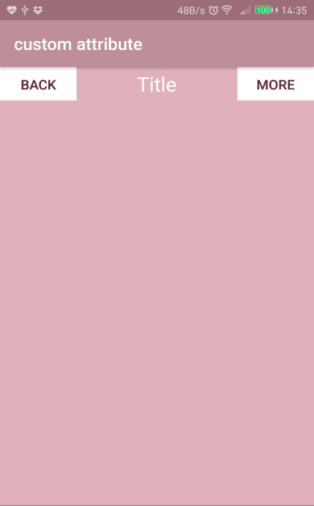

# custom-attribute
custom-attribute 自定義屬性 (改自Android群英傳例題)

自定義屬性，然後將各個組件分別設定，
最後在將三個組件組合起來成一個top bar。 
top bor ↓  
 
全螢幕 ↓  

App download >
https://drive.google.com/open?id=0B0csiWXavBDHcE5pNkV1RWxiZlU
